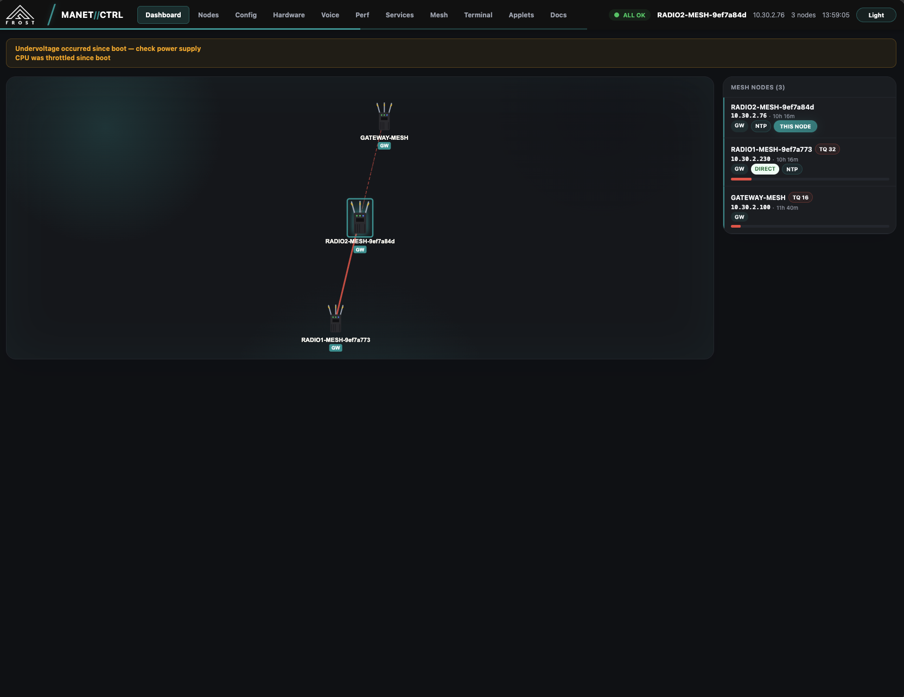
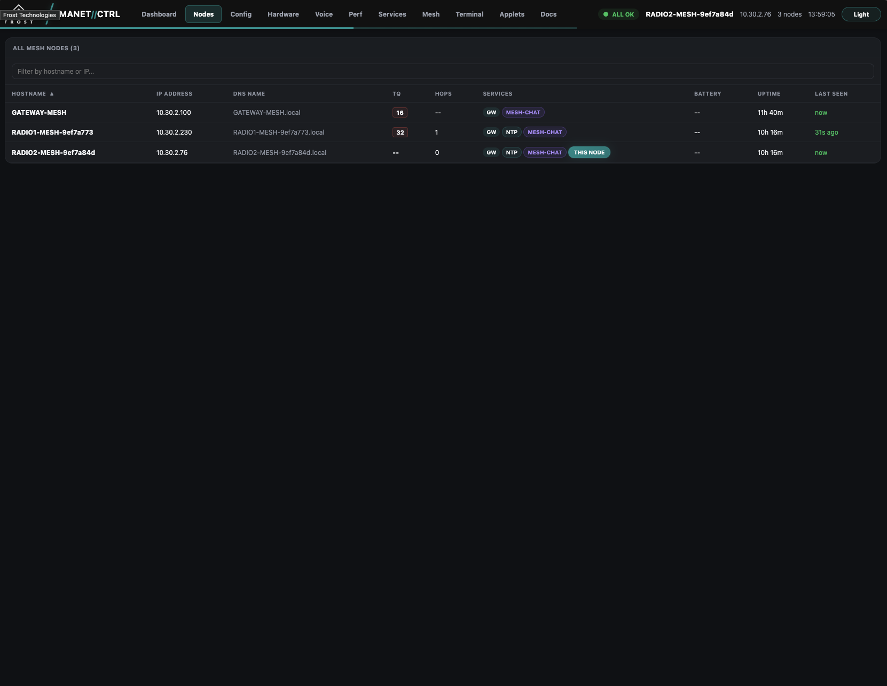
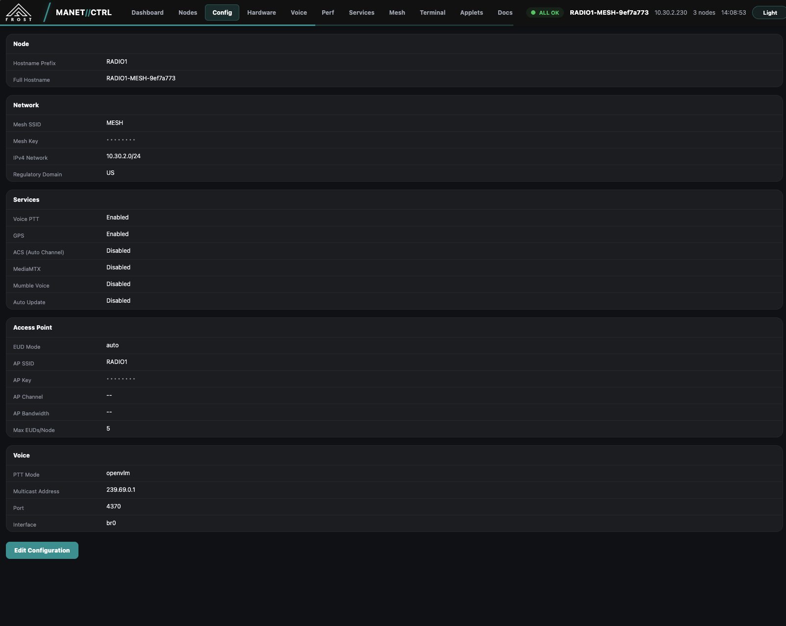
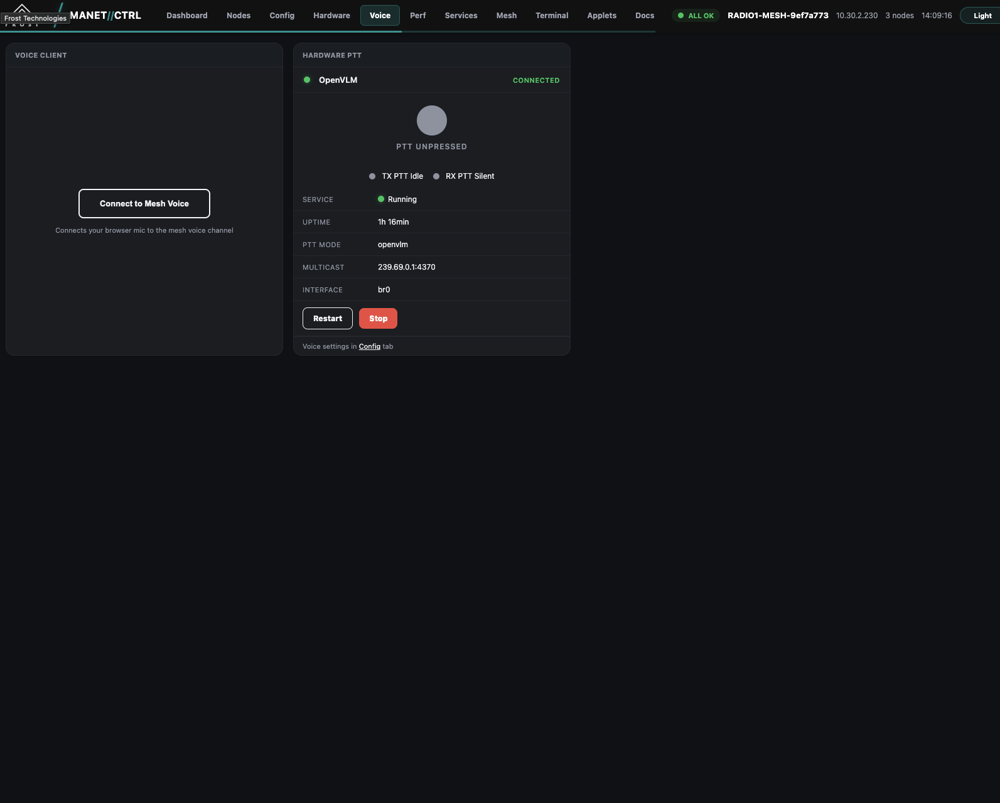
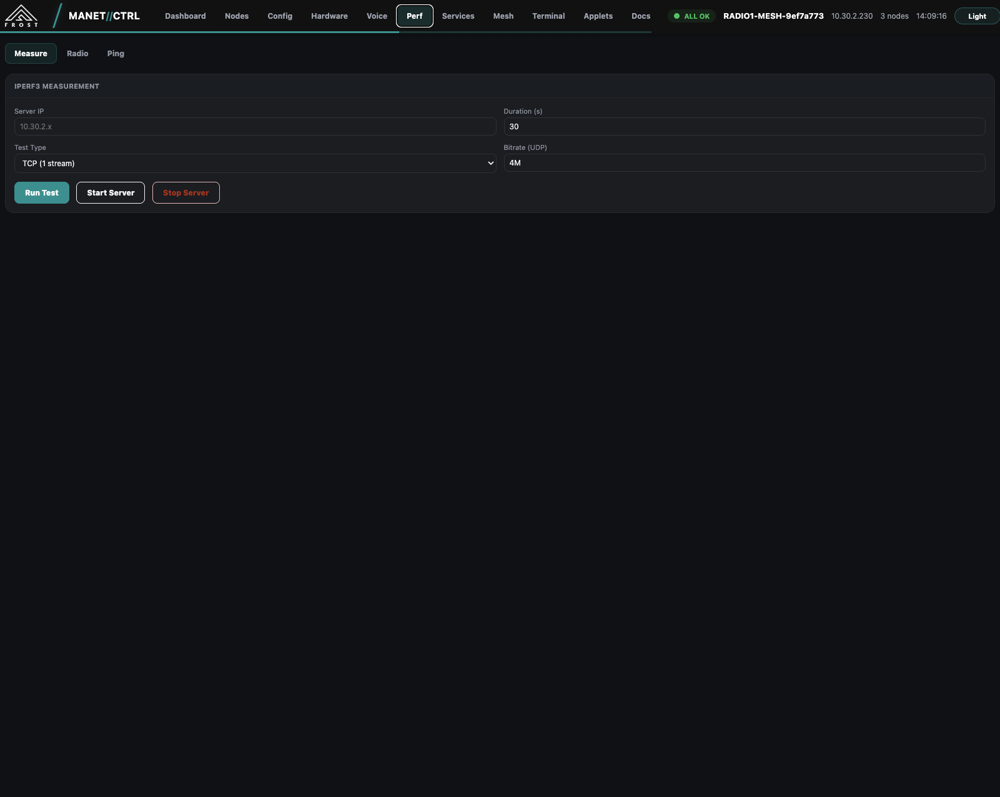
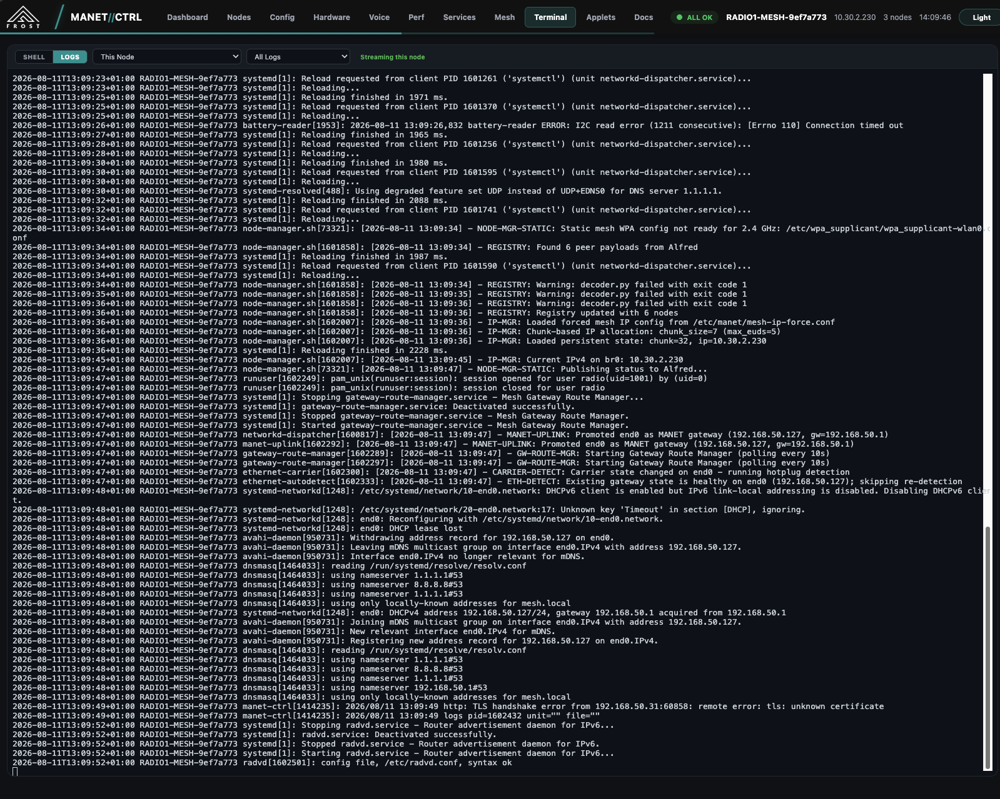

# MANET Project

A complete software suite for provisioning, configuring, and orchestrating Mobile Ad-hoc Network (MANET) nodes on Single Board Computers (SBCs).

The project transforms a Raspberry Pi CM4, Pi 5, Radxa Rock 3A, or x86 gateway into a self-forming, self-healing mesh node using **B.A.T.M.A.N. Advanced** (Layer 2 routing) over **802.11s / 802.11ah HaLow** (sub-GHz, long range) and standard **802.11ax/ac/n** radios. It features zero-configuration addressing, cooperative gateway election, partition healing, push-to-talk voice, a full web UI, installable applets, fleet management, and an Android companion app.

## Key Features

* **Mesh Networking** — batman-adv (BATMAN_V) L2 routing over 802.11ah HaLow (sub-GHz, long range) and standard 802.11ax/ac/n radios. Multi-radio, self-forming, self-healing mesh with SAE (WPA3) authentication and SPI radio watchdog recovery.
* **Zero-Configuration** — Distributed IPv4 allocation, automatic gateway election with NAT failover, `.mesh` DNS for all devices, mesh-wide hostname resolution.
* **Web Interface (MANET//CTRL)** — Single-page dashboard with D3.js topology visualization, node management, live terminal, performance testing, service controls, fleet management, notifications, and built-in documentation. HTTPS with auto-generated TLS.
* **Push-to-Talk Voice** — Opus codec over multicast RTP with hardware PTT (OpenVLM USB, GPIO), web PTT, multi-channel support, half-duplex detection, jitter buffer, and QoS (DSCP EF + WMM AC_VO + tc prio qdisc).
* **Applet System** — Installable mesh applications with DNS integration. Bundled applets: Mesh Chat, Tailscale VPN, WireGuard VPN, Hello World.
* **Fleet Management** — Multicast-based fleet config distribution for coordinated mesh-wide settings changes.
* **EUD Support** — Connect phones/laptops via 5 GHz WiFi AP or Ethernet. DHCP, DNS, and applet hostnames all work transparently for connected devices.
* **Situational Awareness** — GPS integration with CoT/ATAK blue-force tracking, mesh-wide position sharing, CoT relay to EUD devices.
* **Android App** — MANET KDU companion app for mesh status and control from Android devices.
* **OTA Updates** — Go-based update service polls for and applies tools tarball updates automatically.
* **CLI Tool** — `mesh` command with 12+ subcommands for status, node listing, config, radio info, GPS, services, and performance testing.

See [docs/features.md](docs/features.md) for the complete feature list.

## Screenshots

Screenshots of the web interface running on a 3-node HaLow mesh — see [screenshots/](screenshots/).

| Dashboard | Nodes | Config |
|:---------:|:-----:|:------:|
|  |  |  |

| Voice | Performance | Terminal |
|:-----:|:-----------:|:--------:|
|  |  |  |

## Repository Structure

```
MANET/
├── provisioning/          Flashing scripts (Linux, macOS, Windows) and firstrun templates
│   └── x86-gateway/       x86 HaLow gateway provisioning
├── rootfs/                Files deployed to nodes (mirrors target filesystem)
│   ├── etc/systemd/system/   20 systemd service files
│   └── usr/local/
│       ├── bin/           Shell scripts + mesh CLI
│       └── share/
│           ├── applets/   Bundled applets (chat, tailscale, wireguard, hello-world)
│           └── manet/www/ Web UI SPA (HTML, JS, CSS, D3.js, xterm.js)
├── src/                   Go source code
│   ├── manet-ctrl/        Unified web UI + REST API server
│   ├── mesh-manager/      IPv4 allocation, DNS, gateway routes, QoS
│   ├── node-manager/      Radio state sync, channel enforcement, elections
│   ├── gateway-manager/   Gateway detection, NAT, election, failover
│   ├── mesh-registry/     Node discovery via Alfred type 68
│   ├── mesh-voice/        PTT voice over multicast RTP with Opus
│   ├── mesh-chat/         Mesh-wide text chat applet
│   ├── mesh-tailscale/    Tailscale VPN applet
│   ├── mesh-wireguard/    WireGuard VPN applet
│   ├── node-update/       OTA update service
│   ├── cot-emitter/       CoT/ATAK position broadcaster
│   ├── gps-reader/        GPS reader (gpsd)
│   ├── gateway-manager/   Gateway detection and NAT
│   ├── battery-reader/    Waveshare UPS HAT I2C reader
│   ├── applet-hooks/      Pre-install/post-remove hook runner
│   └── mesh-ctrl-android/ Android KDU companion app
├── binaries_arm64/        Pre-compiled ARM64 binaries (alfred, batctl, wpa_supplicant_s1g)
├── packaging/             Build scripts for CM4, RPi5, Rock 3A, x86, tools, and applet tarballs
└── install_packages/      Pre-built install tarballs
```

## Supported Hardware

| Hardware | Support Level | Notes |
| :--- | :--- | :--- |
| **Compute Module 4 (CM4)** | Primary target | 802.11ax + HaLow (SPI) |
| **Raspberry Pi 5** | Functional | 802.11ax + HaLow (SPI) |
| **Radxa Rock 3A** | Functional | 802.11ax + HaLow (SPI) |
| **x86 (gateway)** | Functional | HaLow via USB (Lunpid MM8108) |

## Getting Started

### 1. Prerequisites
You will need a supported SBC and a Linux, macOS, or Windows machine to flash from, plus Ethernet internet access for the SBC being flashed.

See [provisioning/README.md](MANET/provisioning/README.md) for detailed requirements and download links.

### 2. Provisioning a Node
1. Navigate to the `provisioning` directory.
2. Run the flashing script for your host OS (`linux.sh`, `mac.sh`, or `windows.ps1`).
3. Load a saved config or follow the interactive prompts to configure:
    * **EUD Connection**: Wired, Wireless, Both, Auto, or None.
    * **Mesh Security**: SSID and SAE password.
    * **Network Settings**: CIDR blocks and addressing.
    * **Optional Services**: Battery monitoring, auto-update, gateway mode.

### 3. First Boot
Insert the storage media into the node and power it on. The `firstrun.sh` script will, over the course of a few reboots:
1. Disable default setup wizards.
2. Wait for internet connectivity (via Ethernet) to download the latest kernel and tools.
3. Install necessary packages (`batctl`, `alfred`, `wpa_supplicant`, etc.).
4. Configure the radio interfaces.
5. Result in a fully functional mesh node.

## Connectivity Modes

The nodes support connecting external devices (End User Devices) in several ways:

* **Wired**: Connect via Ethernet. The node acts as a bridge or gateway depending on upstream internet access.
* **Wireless**: The node broadcasts a local 5 GHz AP (separate from the mesh backhaul) for clients to join.
* **Both**: Wired and wireless simultaneously.
* **Auto**: Default. Acts as "Wireless" unless an Ethernet device is detected, then switches priority to "Wired".
* **None**: No EUD access — mesh backhaul only.

## Credits

This project is a fork of [very-srs/MANET](https://github.com/very-srs/MANET) with additional contributions from [quietprotocol/MANET](https://github.com/quietprotocol/MANET).

## Documentation
* [Feature List](docs/features.md)
* [Node Architecture](docs/node-architecture.md)
* [Provisioning Guide](MANET/provisioning/README.md)
* [HaLow Range Calculator](docs/halow-range-calc.md)
* [Bill of Materials](MANET/BOM.md)
* [Screenshot Gallery](screenshots/)
