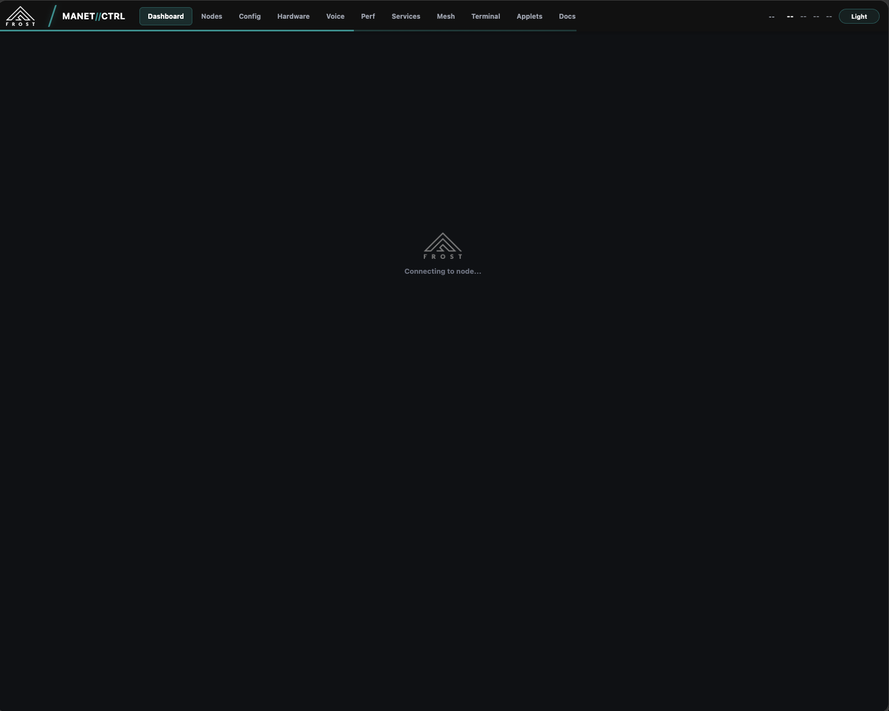
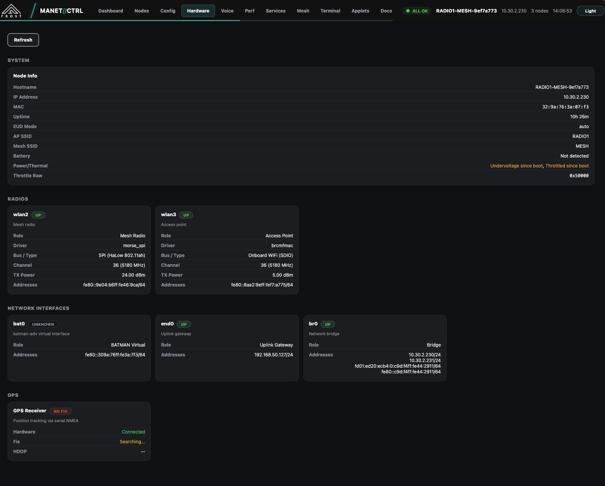
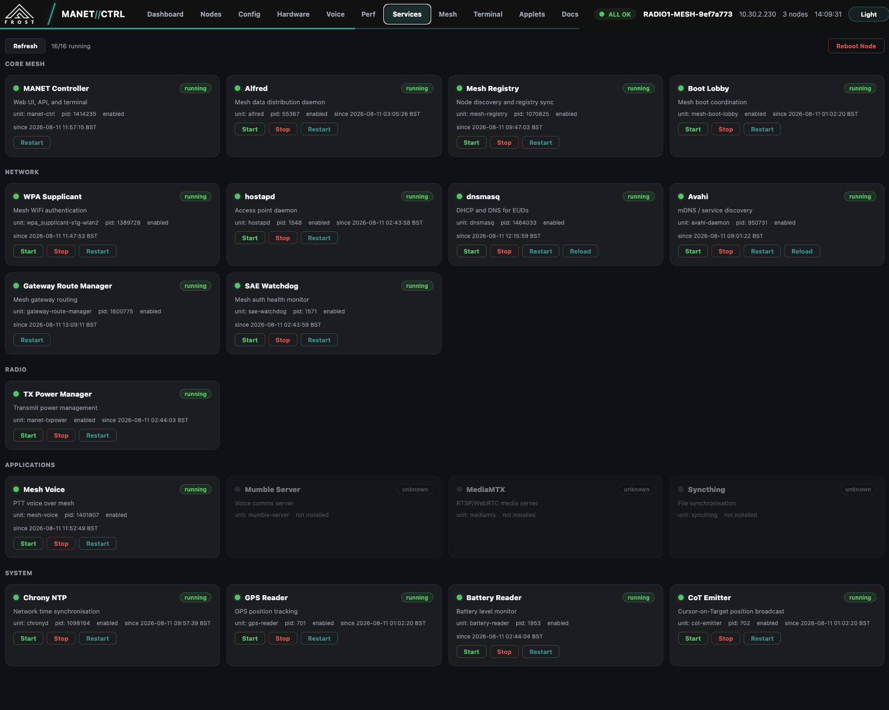
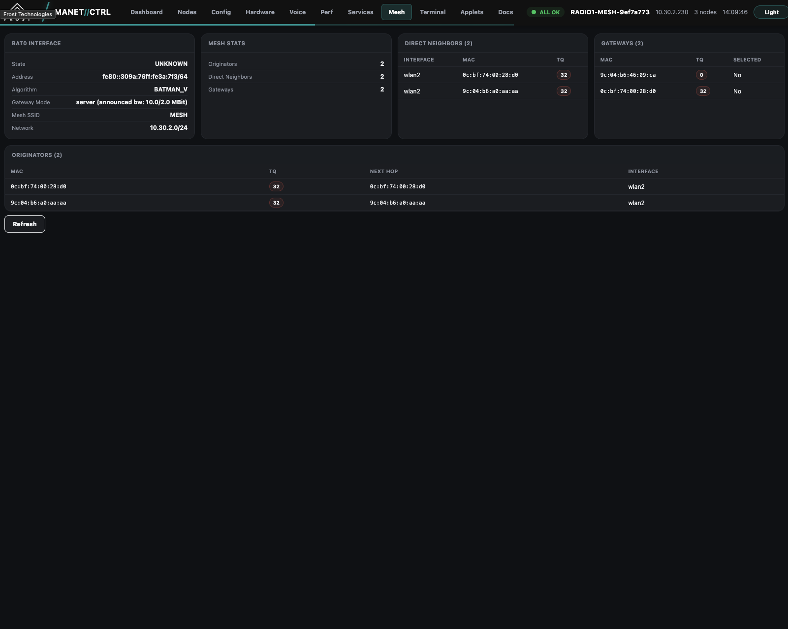
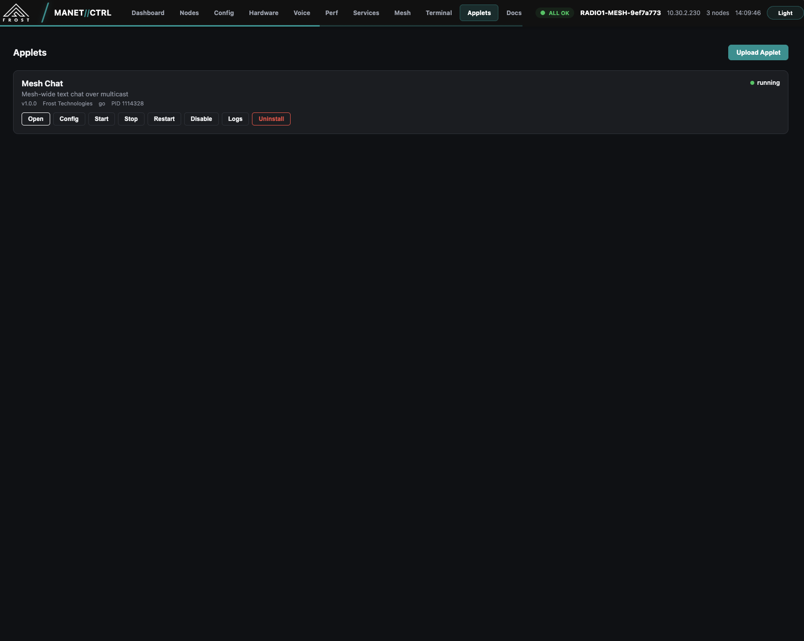
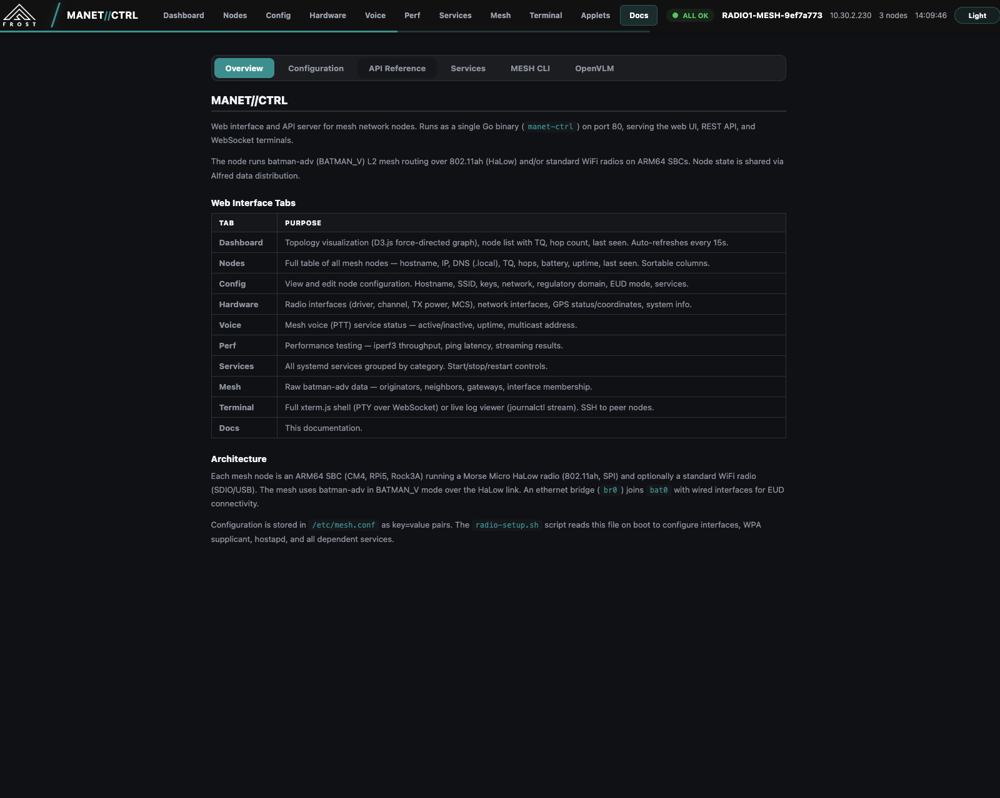

# MANET//CTRL Screenshots

Screenshots of the MANET//CTRL web interface running on a 3-node HaLow mesh (802.11ah) with dark theme.

## Tabs

| # | Screenshot | Tab | Description |
|---|-----------|-----|-------------|
| 1 |  | Dashboard | D3.js force-directed topology showing 3 mesh nodes with node list sidebar. Auto-refreshes every 15s. |
| 2 |  | Nodes | Table of all mesh nodes with hostname, IP, DNS (.local), TQ, hops, services, battery, uptime, last seen. Sortable columns. |
| 3 |  | Dashboard | Loading splash shown while connecting to a node's API. |
| 4 |  | Config | Node and network configuration viewer. Hostname, SSID, regulatory domain, EUD mode, services. Supports stage/activate/cancel workflow. |
| 5 |  | Hardware | System info, radio interfaces (driver, channel, TX power, MCS), network interfaces, GPS status/coordinates. |
| 6 |  | Voice | Mesh voice (PTT) service status. Shows OpenVLM PTT hardware, voice client, service controls. |
| 7 |  | Perf | Performance testing with iperf3 throughput, ping latency. Sub-tabs: Measure, Radio, Ping. |
| 8 |  | Services | All systemd services grouped by category (Core Mesh, Network, Radio, Applications, System). Start/stop/restart controls. 16/16 running. |
| 9 |  | Mesh | Raw batman-adv data: bat0 interface state, mesh stats, direct neighbors, gateways, originators table. |
| 10 |  | Terminal | Live log viewer (journalctl stream) with Shell and Logs sub-tabs. Shows node-manager, registry, gateway route manager activity. |
| 11 |  | Applets | Installable mesh applets. Shows Mesh Chat (v1.0.0, Go) running with open/config/start/stop/restart/disable/logs/uninstall controls. |
| 12 |  | Docs | Built-in documentation with sub-tabs: Overview, Configuration, API Reference, Services, MESH CLI, OpenVLM. Shows architecture and tab reference. |
